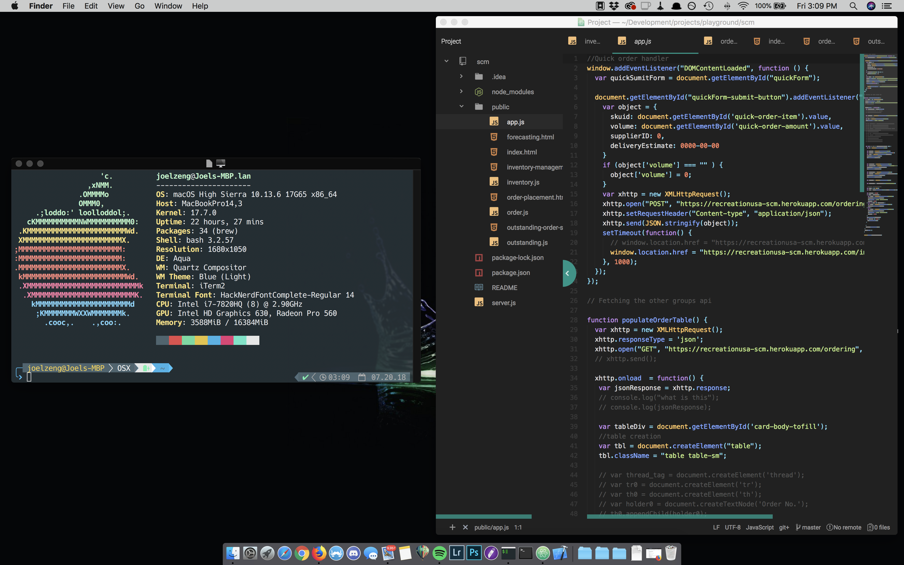

# Development Env installation [OSX]
Shell scripts helping install my customized dev env.

## Usage
git clone repo
chmod u+x executeAll.sh
chmod u+X updateAll.sh

## executeAll.sh
Executes every installation and customization script.

## updateAll.sh
update packages that are commonly needed to update. Run every month or so to ensure optimal system performance.

# Manual adjustment
- iTerm2
  - importing colorschemes = material design or dracula
  - change font [DroidSansMono]
  - Use a different font for non-ASCII text
- manualty setting zsh as iterm2 init.
